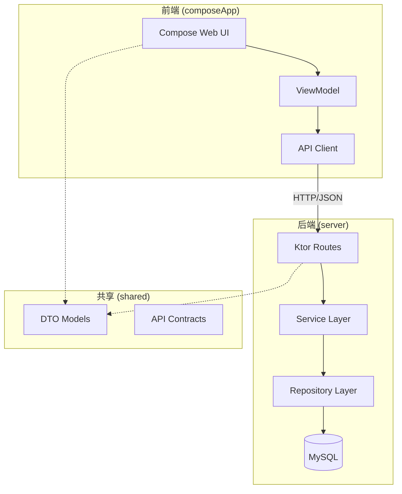

## 用户需求

基于现有 Kotlin Multiplatform 项目搭建个人网站，支持 Web 前端和 Ktor 后端。

## 产品概述

一个完整的个人网站系统，包含首页展示、博客管理、后台管理三大模块，支持用户注册登录、Markdown 博客编写与发布、访问统计分析等功能。

## 核心功能

### 1. 首页介绍模块

- 固定框架的个人简介展示（头像、姓名、简介、社交链接等）
- 部分内容可在后台动态编辑更新

### 2. 博客系统

- 博客列表展示（支持分页、按时间排序）
- 博客详情页（Markdown 内容渲染展示）
- 后台博客管理：新建、编辑、预览、发布、删除
- 集成第三方 Markdown 富文本编辑器
- 博客支持草稿和已发布两种状态

### 3. 用户认证系统

- 用户注册与登录功能
- JWT Token 认证机制
- 后台管理权限控制

### 4. 访问统计系统

- 记录所有页面访问和用户操作
- 统计数据包括：PV/UV、访问来源、设备类型、热门文章等
- 后台可视化报表展示

### 5. 后台管理

- 管理员登录入口
- 博客内容管理
- 首页内容编辑
- 访问统计报表查看

### 6. 公共基础设施

- 统一日志系统
- 统一异常处理
- 统一 API 响应格式
- 数据库配置可外部化

## 技术栈

### 后端 (server 模块)

- **框架**: Ktor 3.3.3
- **数据库**: MySQL + Exposed ORM
- **认证**: Ktor Auth + JWT
- **序列化**: Ktor Content Negotiation + kotlinx.serialization
- **日志**: Logback (已有)
- **连接池**: HikariCP

### 前端 (composeApp 模块)

- **框架**: Compose Multiplatform 1.10.0 (Web)
- **HTTP客户端**: Ktor Client
- **Markdown编辑器**: 集成 editor.md (通过 JS interop)
- **Markdown渲染**: 集成 marked.js
- **路由**: 自定义 Compose Navigation

### 共享模块 (shared)

- **数据模型**: 跨平台 DTO 定义
- **API 契约**: 请求/响应数据结构
- **常量配置**: 共享常量

## 系统架构

### 架构模式

采用前后端分离架构，Compose Web 作为 SPA 前端，Ktor 提供 RESTful API。



### 后端分层架构

```
server/
├── routes/          # API 路由定义
├── service/         # 业务逻辑层
├── repository/      # 数据访问层
├── model/           # 数据库实体
├── plugins/         # Ktor 插件配置
├── config/          # 配置管理
└── common/          # 公共组件（日志、异常处理等）
```

### 前端模块划分

```
composeApp/
├── ui/
│   ├── home/        # 首页
│   ├── blog/        # 博客列表/详情
│   ├── admin/       # 后台管理
│   └── components/  # 公共组件
├── viewmodel/       # 状态管理
├── api/             # API 调用
└── navigation/      # 路由导航
```

## 数据库设计

### 核心表结构

1. **users** - 用户表（id, username, password_hash, email, role, created_at）
2. **blogs** - 博客表（id, title, content, summary, status, author_id, created_at, updated_at, published_at）
3. **site_config** - 站点配置表（id, key, value, updated_at）
4. **access_logs** - 访问日志表（id, path, method, ip, user_agent, user_id, created_at）
5. **statistics** - 统计汇总表（id, date, pv, uv, metric_type, metric_value）

## 实现要点

### 1. 依赖配置 (gradle/libs.versions.toml)

新增依赖：

- Exposed ORM (exposed-core, exposed-dao, exposed-jdbc, exposed-java-time)
- MySQL Connector
- HikariCP 连接池
- Ktor Auth JWT
- Ktor Content Negotiation
- kotlinx-serialization
- Ktor Client (前端)
- kotlinx-datetime (跨平台时间处理)

### 2. 数据库配置外部化

- 使用 application.conf / application.yaml 配置文件
- 支持环境变量覆盖
- 包含 JDBC URL、用户名、密码、连接池参数

### 3. 日志系统增强

- 扩展现有 logback.xml 配置
- 添加文件滚动日志
- 封装统一 Logger 工具类
- 请求/响应日志中间件

### 4. API 设计规范

- 统一响应格式：`{ code, message, data }`
- RESTful 风格路由
- JWT Token 在 Authorization Header 传递

### 5. Markdown 编辑器集成

- 使用 editor.md 作为编辑器（通过 Kotlin/JS interop）
- 使用 marked.js 进行前端渲染
- 支持实时预览

### 6. 访问统计实现

- Ktor 拦截器记录所有请求
- 异步写入数据库（避免影响响应性能）
- 定时任务汇总统计数据

## 目录结构

### Server 模块新增/修改文件

```
server/src/main/
├── kotlin/io/lugf027/github/mywebsite/
│   ├── Application.kt                    # [MODIFY] 重构应用入口，加载插件
│   ├── plugins/
│   │   ├── Routing.kt                    # [NEW] 路由配置
│   │   ├── Serialization.kt              # [NEW] JSON序列化配置
│   │   ├── Authentication.kt             # [NEW] JWT认证配置
│   │   ├── Database.kt                   # [NEW] 数据库连接配置
│   │   ├── Logging.kt                    # [NEW] 请求日志中间件
│   │   └── StatusPages.kt                # [NEW] 统一异常处理
│   ├── config/
│   │   └── AppConfig.kt                  # [NEW] 配置读取工具
│   ├── model/
│   │   ├── tables/
│   │   │   ├── Users.kt                  # [NEW] 用户表定义
│   │   │   ├── Blogs.kt                  # [NEW] 博客表定义
│   │   │   ├── SiteConfigs.kt            # [NEW] 站点配置表
│   │   │   └── AccessLogs.kt             # [NEW] 访问日志表
│   │   └── entities/
│   │       ├── User.kt                   # [NEW] 用户实体
│   │       ├── Blog.kt                   # [NEW] 博客实体
│   │       └── AccessLog.kt              # [NEW] 访问日志实体
│   ├── repository/
│   │   ├── UserRepository.kt             # [NEW] 用户数据访问
│   │   ├── BlogRepository.kt             # [NEW] 博客数据访问
│   │   ├── SiteConfigRepository.kt       # [NEW] 站点配置数据访问
│   │   └── AccessLogRepository.kt        # [NEW] 访问日志数据访问
│   ├── service/
│   │   ├── AuthService.kt                # [NEW] 认证服务
│   │   ├── BlogService.kt                # [NEW] 博客服务
│   │   ├── SiteConfigService.kt          # [NEW] 站点配置服务
│   │   └── StatisticsService.kt          # [NEW] 统计服务
│   ├── routes/
│   │   ├── AuthRoutes.kt                 # [NEW] 认证相关API
│   │   ├── BlogRoutes.kt                 # [NEW] 博客相关API
│   │   ├── AdminRoutes.kt                # [NEW] 后台管理API
│   │   └── StatisticsRoutes.kt           # [NEW] 统计数据API
│   └── common/
│       ├── Logger.kt                     # [NEW] 日志工具封装
│       ├── Response.kt                   # [NEW] 统一响应格式
│       └── Exceptions.kt                 # [NEW] 自定义异常
└── resources/
    ├── application.conf                  # [NEW] 应用配置文件
    └── logback.xml                       # [MODIFY] 增强日志配置
```

### ComposeApp 模块新增/修改文件

```
composeApp/src/webMain/
├── kotlin/io/lugf027/github/mywebsite/
│   ├── main.kt                           # [MODIFY] 入口配置
│   ├── App.kt                            # [MODIFY] 重构为路由容器
│   ├── navigation/
│   │   └── NavHost.kt                    # [NEW] 导航路由管理
│   ├── api/
│   │   ├── ApiClient.kt                  # [NEW] HTTP客户端封装
│   │   ├── AuthApi.kt                    # [NEW] 认证API调用
│   │   ├── BlogApi.kt                    # [NEW] 博客API调用
│   │   └── AdminApi.kt                   # [NEW] 后台API调用
│   ├── viewmodel/
│   │   ├── AuthViewModel.kt              # [NEW] 认证状态管理
│   │   ├── BlogViewModel.kt              # [NEW] 博客状态管理
│   │   ├── HomeViewModel.kt              # [NEW] 首页状态管理
│   │   └── AdminViewModel.kt             # [NEW] 后台状态管理
│   ├── ui/
│   │   ├── theme/
│   │   │   └── AppTheme.kt               # [NEW] 主题配置
│   │   ├── components/
│   │   │   ├── Header.kt                 # [NEW] 顶部导航栏
│   │   │   ├── Footer.kt                 # [NEW] 页脚组件
│   │   │   ├── Loading.kt                # [NEW] 加载状态组件
│   │   │   └── MarkdownViewer.kt         # [NEW] Markdown渲染组件
│   │   ├── home/
│   │   │   └── HomePage.kt               # [NEW] 首页
│   │   ├── blog/
│   │   │   ├── BlogListPage.kt           # [NEW] 博客列表页
│   │   │   └── BlogDetailPage.kt         # [NEW] 博客详情页
│   │   └── admin/
│   │       ├── LoginPage.kt              # [NEW] 登录页
│   │       ├── RegisterPage.kt           # [NEW] 注册页
│   │       ├── DashboardPage.kt          # [NEW] 后台仪表盘
│   │       ├── BlogManagePage.kt         # [NEW] 博客管理页
│   │       ├── BlogEditorPage.kt         # [NEW] 博客编辑页
│   │       ├── SiteConfigPage.kt         # [NEW] 站点配置页
│   │       └── StatisticsPage.kt         # [NEW] 统计报表页
│   └── utils/
│       ├── JsInterop.kt                  # [NEW] JS互操作工具
│       └── Storage.kt                    # [NEW] 本地存储工具
└── resources/
    └── index.html                        # [MODIFY] 引入editor.md/marked.js
```

### Shared 模块新增文件

```
shared/src/commonMain/
└── kotlin/io/lugf027/github/mywebsite/
    ├── Constants.kt                      # [MODIFY] 增加API路径常量
    ├── dto/
    │   ├── ApiResponse.kt                # [NEW] 统一响应DTO
    │   ├── UserDto.kt                    # [NEW] 用户相关DTO
    │   ├── BlogDto.kt                    # [NEW] 博客相关DTO
    │   ├── SiteConfigDto.kt              # [NEW] 站点配置DTO
    │   └── StatisticsDto.kt              # [NEW] 统计数据DTO
    └── api/
        └── ApiRoutes.kt                  # [NEW] API路径定义
```

### 根目录配置文件

```
/
├── gradle/libs.versions.toml             # [MODIFY] 添加新依赖版本
├── server/build.gradle.kts               # [MODIFY] 添加服务端依赖
├── composeApp/build.gradle.kts           # [MODIFY] 添加前端依赖
└── shared/build.gradle.kts               # [MODIFY] 添加共享模块依赖
```

## 设计风格

采用现代简约风格，以清晰的信息层次和舒适的阅读体验为核心。整体设计追求专业、简洁、优雅的视觉效果。

注意：本项目使用 Compose Multiplatform for Web，非传统 React 框架，但设计理念参考现代 Web 设计规范。

## 页面规划

### 1. 首页 (HomePage)

- **顶部导航栏**: 固定在顶部，包含 Logo、导航菜单（首页/博客/关于）、登录入口
- **个人介绍区**: 居中展示，包含头像（圆形带边框）、姓名、职位/标签、简短介绍
- **社交链接区**: 水平排列的社交媒体图标按钮（GitHub/LinkedIn/Email等）
- **最新博客区**: 展示最近3-5篇博客卡片，支持快速跳转
- **页脚**: 版权信息、备案号等

### 2. 博客列表页 (BlogListPage)

- **顶部导航栏**: 同首页
- **搜索/筛选区**: 支持关键词搜索
- **博客卡片列表**: 卡片式布局，每张卡片包含标题、摘要、发布时间、阅读量
- **分页组件**: 底部分页导航
- **页脚**: 同首页

### 3. 博客详情页 (BlogDetailPage)

- **顶部导航栏**: 同首页
- **文章标题区**: 大标题、作者、发布时间、阅读量
- **Markdown内容区**: 渲染后的博客正文，支持代码高亮、图片、表格等
- **返回按钮**: 快速返回博客列表
- **页脚**: 同首页

### 4. 登录/注册页 (LoginPage/RegisterPage)

- **简洁表单卡片**: 居中显示，包含用户名/密码输入框
- **表单验证**: 实时校验提示
- **切换链接**: 登录/注册页面互相切换

### 5. 后台仪表盘 (DashboardPage)

- **侧边导航栏**: 固定在左侧，包含菜单项（仪表盘/博客管理/站点设置/统计数据）
- **顶部工具栏**: 用户信息、退出登录按钮
- **统计卡片区**: 展示关键指标（总访问量/今日PV/文章数/用户数）
- **快捷操作区**: 常用功能入口

### 6. 博客管理页 (BlogManagePage)

- **侧边导航栏**: 同后台仪表盘
- **工具栏**: 新建博客按钮、搜索框
- **博客数据表格**: 列表展示所有博客，支持编辑/删除/发布操作
- **分页组件**: 表格底部分页

### 7. 博客编辑页 (BlogEditorPage)

- **标题输入区**: 顶部大输入框
- **Markdown编辑器**: 集成 editor.md，支持工具栏、实时预览
- **操作按钮区**: 保存草稿、预览、发布按钮

### 8. 统计报表页 (StatisticsPage)

- **侧边导航栏**: 同后台仪表盘
- **时间筛选器**: 选择统计时间范围
- **图表展示区**: PV/UV趋势图、访问来源饼图、热门文章排行

## Agent Extensions

### SubAgent

- **code-explorer**
- 用途：在实现过程中探索代码库，确保新增代码与现有架构一致
- 预期结果：准确定位修改点，复用现有模式和工具类